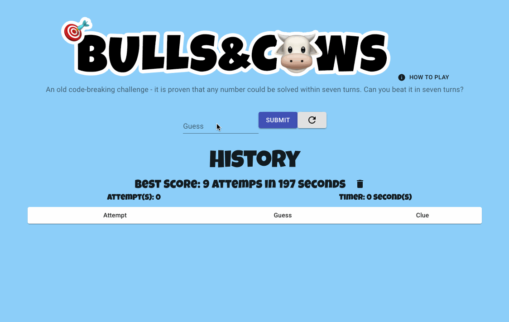
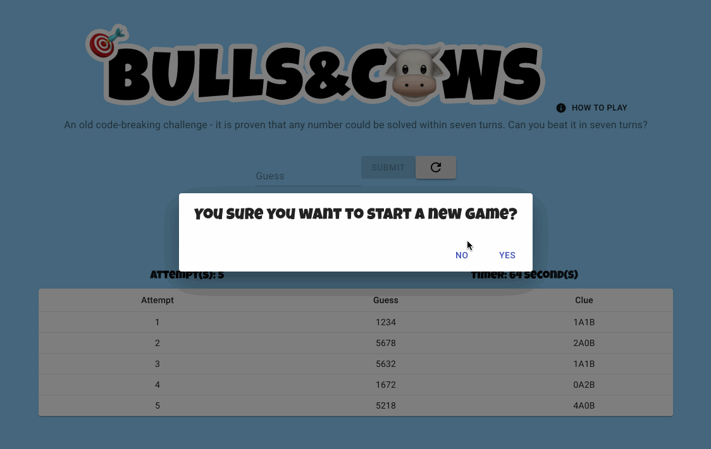

# 🎯Bulls & C🐮ws

Bulls & Cows (aka 1A2B) is a mini code breaking challenge game. It's predate a similar kind board game, mastermind. Read more about it here: https://en.wikipedia.org/wiki/Bulls_and_Cows

# 💡Features

- Guess field and history section
- Attempt counter and timer
- Explosive Confetti when user guess the number correctly. (Use the package - https://www.npmjs.com/package/react-dom-confetti)
  
- How To Play instruction button (popover)
- Best score record and delete best score button
- New Game / Restart button
  
- Input limitation - numbers only, must be 4 numbers long, cannot duplicate

# 🖥️ Tech

- React (Create-React-App)
- CSS
- HTML
- Material-UI

# 🛠️ Future Improvements

- Allow enter button for submit
- Better mobile optimzation
- Cheats & clues

# 🚀 License

MIT license
